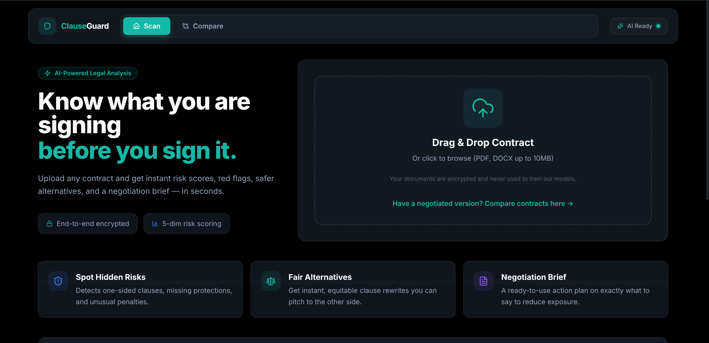
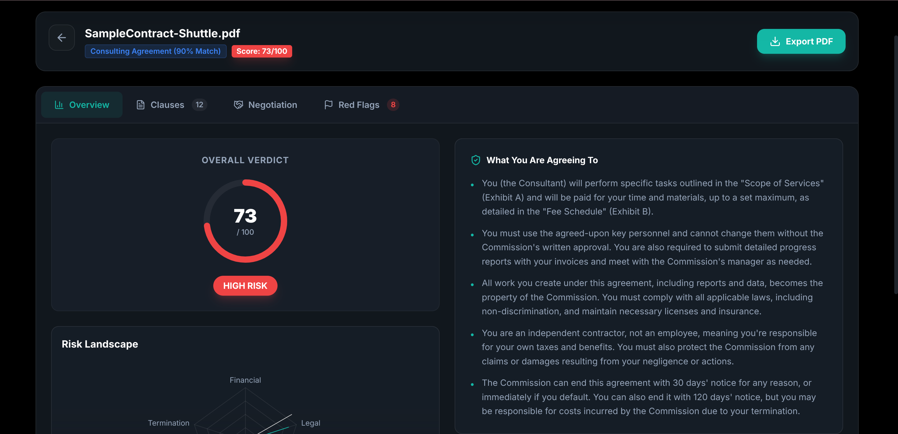
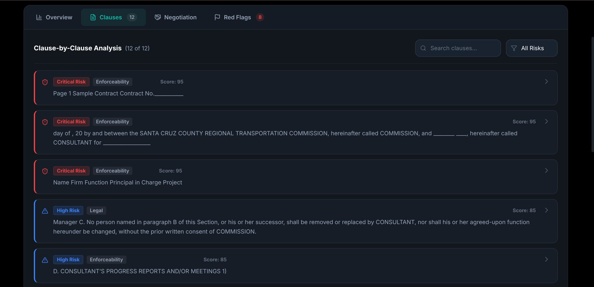
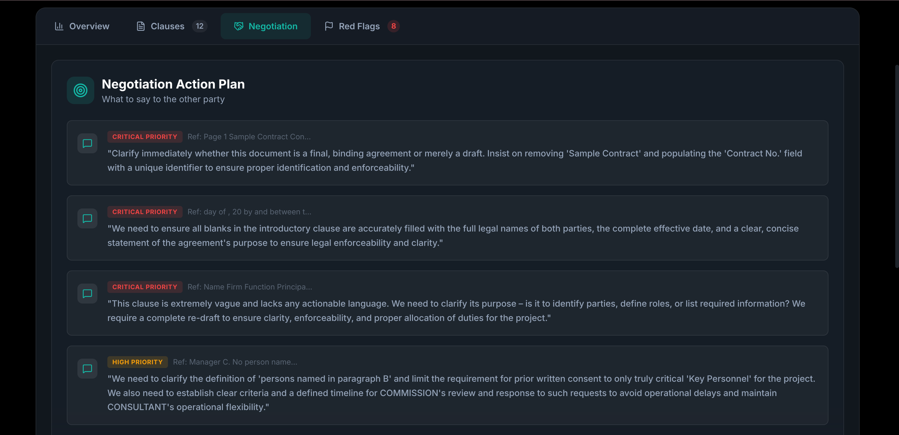
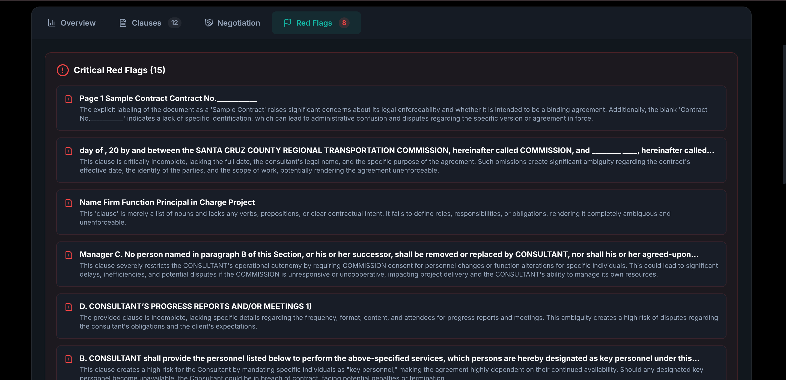
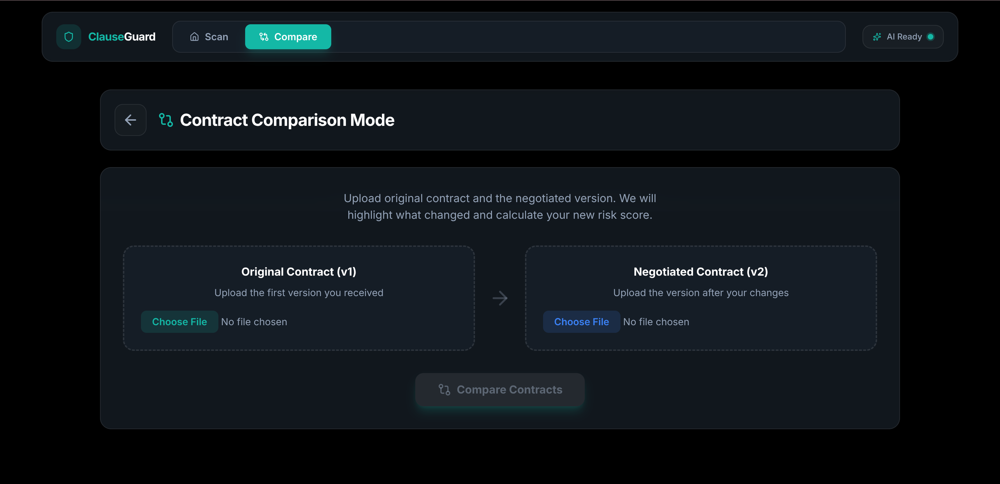

# 🛡️ ClauseGuard — AI-Powered Contract Risk Analyzer

> Upload any contract. Get instant risk scores, red flags, safer alternatives, and a negotiation brief — powered by Gemini AI.

---

## Table of Contents

- [Overview](#overview)
- [Pipeline & Data Flow](#pipeline--data-flow)
- [Features](#features)
- [Tech Stack](#tech-stack)
- [API Reference](#api-reference)
- [Project Structure](#project-structure)
- [Getting Started](#getting-started)

---

## Overview

ClauseGuard is a full-stack AI application that analyzes legal contracts for non-lawyers. Upload a PDF or DOCX, and the system segments it into clauses, classifies the contract type, scores each clause for risk across 5 dimensions, generates safe rewrites, and produces a negotiation action plan.

---

## Pipeline & Data Flow

```
Upload (PDF / DOCX)
        │
        ▼
┌──────────────────────────────────────────────────────────────────────┐
│  parser.py                                                           │
│  PyMuPDF / python-docx → clean text → spaCy sentence segmentation   │
│  Output: List of clause strings (max 20)                             │
└──────────────────────────────────────────────────────────────────────┘
        │
        ▼
┌──────────────────────────────────────────────────────────────────────┐
│  classifier.py                                                       │
│  facebook/bart-large-mnli (zero-shot) on first 1,500 chars          │
│  Output: (contract_type, confidence)                                 │
└──────────────────────────────────────────────────────────────────────┘
        │
        ▼
┌──────────────────────────────────────────────────────────────────────┐
│  analyzer.py                                                         │
│  gemini-2.0-flash — batches of 4 clauses, 15s inter-batch delay     │
│  Per clause → risk_score, risk_level, risk_category,                │
│               explanation, safer_alternative, negotiation_point      │
│  Also → 5-point plain-English summary (separate Gemini call)        │
│  Post-processing → negotiation_brief[], compliance_flags[]           │
└──────────────────────────────────────────────────────────────────────┘
        │
        ▼
  JSON Response → React Frontend (tabbed dashboard)
        │
        └── jsPDF export (client-side, no server round-trip)
```

For contract comparison, both files go through the same parse pipeline and embeddings are computed via `sentence-transformers/all-MiniLM-L6-v2`.

---

## Features

### Upload & Parsing



| Step | Detail |
|------|--------|
| File types | PDF (PyMuPDF page-by-page) and DOCX (python-docx paragraphs) |
| Text cleaning | Regex collapses newlines and whitespace |
| Segmentation | spaCy `en_core_web_sm` sentence boundary detection; clauses < 30 chars discarded |
| Cap | Top 20 clauses sent to AI to stay within free-tier rate limits |

---

### Contract Classification

| Aspect | Detail |
|--------|--------|
| Model | `facebook/bart-large-mnli` (HuggingFace zero-shot pipeline) |
| Input | First 1,500 characters of document |
| Candidate labels | NDA, Employment, SaaS/Software License, Vendor, Partnership, Commercial Lease, Consulting, Share Purchase, General Commercial |
| Confidence threshold | < 0.4 → falls back to `"General Commercial Contract"` |
| Hard fallback | Keyword regex scan if model fails to load |
| UI | Displayed as `"Consulting Agreement (90% Match)"` badge |

---

### AI Risk Analysis



**Per-clause fields returned by Gemini:**

| Field | Type | Description |
|-------|------|-------------|
| `risk_score` | int 0–100 | Numeric severity |
| `risk_level` | enum | `Low` / `Medium` / `High` / `Critical` |
| `risk_category` | enum | `Financial` / `Legal` / `Compliance` / `Enforceability` / `Termination` |
| `explanation` | string | 2-sentence plain-English reason |
| `safer_alternative` | string | Full rewritten clause |
| `negotiation_point` | string | Specific ask for the counterparty |

**Scoring:** `overall_score` = arithmetic mean of all clause scores. Clauses returned sorted descending by score.

**Rate limiting:** Batches of 4 clauses processed concurrently via `asyncio.gather()`, with a 15-second pause between batches for Gemini free-tier compliance.

---

### Clause Browser



| Feature | Implementation |
|---------|----------------|
| Color-coded cards | 2px left border — red (Critical), orange (High), yellow (Medium), green (Low) |
| Default sort | Descending by `risk_score` (inherits backend sort) |
| Search | `String.includes()` on `original_text`; matches highlighted via regex + `<mark>` tag |
| Filter | `useMemo` hook on risk level — no re-fetch |
| Expand | Click to reveal full text, explanation, and safe rewrite diff |

---

### Safe Rewrite & Diff View

| Aspect | Detail |
|--------|--------|
| Availability | All `High` and `Critical` clauses |
| Display | Two-column panel: original (red-tinted) vs. suggested (green-tinted) |
| Copy | `navigator.clipboard.writeText()` hover button |
| Generation | Produced in the same Gemini call as the risk score — no extra latency |

---

### Negotiation Action Plan



| Aspect | Detail |
|--------|--------|
| Source | Pure Python post-processing of analyzed clauses — no additional AI call |
| Trigger | Any clause with `risk_level` in `["High", "Critical"]` |
| Output | Quoted talking points with severity badge and clause reference |

---

### Red Flags Panel



| Aspect | Detail |
|--------|--------|
| Sources | Clauses with `risk_score ≥ 80` + `compliance_flags[]` from backend |
| Tab badge | Shows total count of High + Critical clauses |
| Display | Danger-bordered cards (critical) and warning-bordered cards (compliance) |

---

### Contract Comparison



| Step | Detail |
|------|--------|
| Input | Two files (`file1` = original, `file2` = negotiated) via `multipart/form-data` |
| Embeddings | `sentence-transformers/all-MiniLM-L6-v2` encodes both clause lists |
| Output | `delta_score`, human-readable message, and `changes[]` array per modified clause |
| Display | Side-by-side diff cards color-coded by change type (Risk Decreased / Increased / Neutral) |

---

### Other Features

| Feature | Detail |
|---------|--------|
| **PDF Export** | Client-side only via **jsPDF** — no server round-trip; includes score, summary, and filename |
| **Local History** | Analyses serialized to `localStorage` under `analysis_<id>`; last 5 shown on homepage with color-coded scores |
| **Demo Mode** | `?demo=true` query param loads a hardcoded mock payload — works with no backend or API key |

---

## Tech Stack

### Backend

| Library | Purpose |
|---------|---------|
| FastAPI + uvicorn | Async REST API |
| PyMuPDF (`fitz`) | PDF text extraction |
| python-docx | DOCX extraction |
| spaCy `en_core_web_sm` | Clause segmentation |
| `facebook/bart-large-mnli` | Zero-shot contract classification |
| `gemini-2.0-flash` (Google GenAI) | Per-clause risk analysis & summary |
| `all-MiniLM-L6-v2` | Semantic embeddings for contract comparison |

### Frontend

| Library | Purpose |
|---------|---------|
| React 18 + TypeScript | Component UI |
| Vite | Build tool & dev server |
| Tailwind CSS | Styling |
| Recharts | RadarChart for risk visualization |
| jsPDF | Client-side PDF export |
| react-router-dom v6 | Client-side routing |

---

## API Reference

### `POST /upload`

| | |
|--|--|
| Body | `multipart/form-data` — field `file` (PDF or DOCX, ≤ 10 MB) |
| Response | Full analysis JSON: `id`, `filename`, `contract_type`, `type_confidence`, `overall_score`, `summary[]`, `clauses[]`, `negotiation_brief[]`, `compliance_flags[]` |

### `POST /compare`

| | |
|--|--|
| Body | `multipart/form-data` — fields `file1` (v1), `file2` (v2) |
| Response | `delta_score`, `message`, `changes[]` (each with `type`, `old_text`, `new_text`, `explanation`) |

### `GET /health`

Returns `{"status": "healthy"}` — used by Docker health checks.

---

## Project Structure

```
clauseGuard/
├── backend/
│   ├── main.py           # FastAPI routes + CORS
│   ├── parser.py         # Text extraction + spaCy segmentation
│   ├── classifier.py     # Zero-shot contract type detection
│   ├── analyzer.py       # Gemini AI analysis, summary, briefs, flags
│   ├── comparator.py     # Semantic diff via sentence-transformers
│   └── Dockerfile
├── frontend/
│   ├── public/images/    # Screenshots
│   └── src/
│       ├── pages/        # HomePage, AnalysisPage, ComparePage
│       └── components/   # UploadZone, RiskDashboard, ClauseList,
│                         # DiffView, NegoBrief, RedFlagPanel, ReportExport
├── docker-compose.yml
├── .env.example
└── SETUP.md
```

---

## Getting Started

### Docker (Recommended)

```bash
git clone https://github.com/rj9884/clauseGuard.git && cd clauseGuard
cp .env.example .env        # Add GEMINI_API_KEY
docker compose up --build -d
```

| Service | URL |
|---------|-----|
| Frontend | http://localhost:5173 |
| Backend API docs | http://localhost:8000/docs |

> **First-run note:** Backend downloads `facebook/bart-large-mnli` (~1.6 GB) and `all-MiniLM-L6-v2` (~90 MB). Monitor with `docker compose logs backend -f`.

### Environment Variables

| Variable | Required | Description |
|----------|----------|-------------|
| `GEMINI_API_KEY` | ✅ | Google Gemini API key ([get one free](https://aistudio.google.com/apikey)) |

For manual setup without Docker, see [SETUP.md](SETUP.md).

---

## License

MIT — see [LICENSE](LICENSE).
